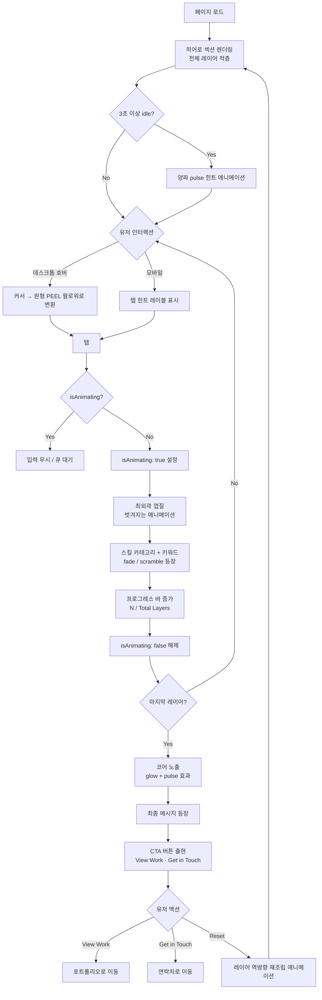

# The Skill Onion — UX Flow

---

## 유저 시나리오

### 시나리오 1: 첫 방문자 — 양파 발견

- **사용자**: 포트폴리오를 처음 방문한 리크루터 또는 클라이언트
- **목표**: 이 디자이너가 누구이고 무엇을 할 수 있는지 파악
- **플로우**:
  1. 페이지 로드 — 3D 스타일의 레이어드 양파가 화면 중앙에 등장
  2. 유저가 양파 쪽으로 커서를 이동
  3. 커서가 `[ PEEL ]` 텍스트가 표시되는 원형 팔로워로 변환
  4. 클릭 — 가장 바깥 껍질이 벗겨져 나가는 애니메이션
  5. 첫 번째 스킬 카테고리와 키워드가 fade/scramble 효과로 등장
  6. 프로그레스 바 업데이트: `1 / 8 Layers Peeled`
- **성공 조건**: 별도의 안내 텍스트 없이 유저가 인터랙션을 즉시 이해
- **예외 상황**: 커서가 3초 이상 정지 시, 양파에 은은한 pulse 애니메이션으로 첫 클릭 유도

---

### 시나리오 2: 레이어 순차 벗기기

- **사용자**: 레이어를 하나씩 능동적으로 벗기는 방문자
- **목표**: 모든 스킬 카테고리 발견
- **플로우**:
  1. 클릭마다 껍질 벗겨짐 → 스킬 공개 → 진행 업데이트 순서로 실행
  2. 각 레이어마다 새로운 카테고리명 + 키워드 목록 노출
  3. 사운드가 켜진 경우 껍질 제거 시 효과음 재생
  4. 프로그레스 바가 증가하며 남은 레이어 수 예측 가능
  5. `isAnimating: true` 락으로 애니메이션 중 더블클릭 방지
- **성공 조건**: 유저가 혼란이나 불편함 없이 모든 레이어 완료
- **예외 상황**: 애니메이션 중 클릭 → 애니메이션 완료 전까지 입력 무시 또는 큐 대기

---

### 시나리오 3: 코어 도달 (완료 상태)

- **사용자**: 모든 레이어를 다 벗긴 방문자
- **목표**: 최종 공개를 보고 다음 행동으로 이동
- **플로우**:
  1. 마지막 껍질이 제거 → 양파 코어가 글로우 / 펄스 효과와 함께 노출
  2. 최종 메시지 등장 (예: "You've seen it all. Now let's build something.")
  3. CTA 버튼 2개 출현: **View Work**, **Get in Touch**
  4. CTA 아래에 작은 **Reset** 링크 표시
- **성공 조건**: 유저가 CTA를 클릭하거나 리셋하여 재경험
- **예외 상황**: 유저가 탭을 닫는 경우 — 별도 처리 불필요

---

### 시나리오 4: 리셋 및 재경험

- **사용자**: 특정 레이어를 다시 보거나 인터랙션을 재경험하고 싶은 방문자
- **목표**: 양파를 원래 상태로 되돌리고 처음부터 다시 시작
- **플로우**:
  1. Reset 클릭 (완료 상태에서 표시, 또는 화면 내 지속 노출 아이콘)
  2. 레이어들이 역방향 애니메이션으로 재조립
  3. 상태가 `currentLayerIndex: 0`으로 초기화
  4. 인터랙션 재시작 가능
- **성공 조건**: 부드러운 재조립 애니메이션, 상태 점프 없이 자연스럽게 복귀
- **예외 상황**: 벗기기 진행 중 리셋 → 현재 애니메이션 완료 후 리셋 실행

---

### 시나리오 5: 모바일 탭 경험

- **사용자**: 모바일 기기로 방문한 방문자
- **목표**: 데스크톱과 동일한 껍질 벗기기 경험을 터치로 제공
- **플로우**:
  1. 양파가 약간 작게 렌더링되어 화면 중앙에 배치
  2. 커서 팔로워 없음 (데스크톱 전용) — 대신 양파 하단에 탭 힌트 레이블(`Tap to peel`) 표시
  3. 탭으로 데스크톱과 동일한 껍질 벗겨지는 애니메이션 + 스킬 공개 시퀀스 실행
  4. 프로그레스 바와 스킬 패널이 수직 스택 레이아웃으로 배치
- **성공 조건**: 터치 탭이 데스크톱 클릭만큼 만족스럽게 느껴짐
- **예외 상황**: 핀치/줌 무시 — 싱글 탭만 트리거로 작동

---

## UX 플로우 다이어그램



---

## 타이포그래피 및 카피라이팅

| 역할 | 카피 | 비고 |
|------|------|------|
| **Kicker** (최상단 태그) | `The Skill Onion Project` | 소문자 트래킹 넓게, 절제된 톤 |
| **H1** (메인 타이틀) | `Like an Onion: Layers of Skills to Peel Back.` | 후보 A — 양파 메타포 직접 명시 |
| **H1** (메인 타이틀) | `Unpeeling my skillset` | 후보 B — 동작 중심, 간결 |
| **Subtext** (서브 타이틀) | `I'm a UI/UX designer with depth. Scroll to peel back the layers and discover the diverse skill set I bring to the table.` | H1 아래 1~2줄, 인터랙션 유도 포함 |

> H1 후보 A / B 중 최종 선택은 Visual Direction 단계에서 결정

---

## 정보 구조 (IA)

```
The Skill Onion — 히어로 섹션
├── 유틸리티 바 (우상단, 항상 표시)
│   └── 사운드 토글 (On / Off)
│
├── 양파 오브젝트 (중앙)
│   ├── 레이어 1 — 가장 바깥 껍질
│   ├── 레이어 2
│   ├── ...
│   ├── 레이어 N
│   └── 코어 — 가장 안쪽, 마지막에 노출
│
├── 스킬 표시 패널 (양파 오른쪽 / 모바일에서는 하단)
│   ├── 카테고리명 (예: "UI / UX Design")
│   └── 키워드 목록 (예: "Figma · Wireframing · Prototyping")
│
├── 진행 인디케이터 (양파 하단)
│   └── "N / Total Layers Peeled" + 게이지 바
│
└── 완료 상태 (마지막 껍질 제거 후 스킬 패널 대체)
    ├── 최종 메시지
    ├── CTA — View Work
    ├── CTA — Get in Touch
    └── Reset 링크
```

---

## 데이터 모델

| 엔티티 | 주요 필드 | 비고 |
|--------|----------|------|
| `Layer` | `id: number`, `category: string`, `keywords: string[]`, `colorToken: string`, `isRevealed: boolean` | 레이어 1개당 객체 1개, 바깥 → 안쪽 순서 |
| `OnionState` | `currentLayerIndex: number`, `isComplete: boolean`, `isSoundEnabled: boolean`, `isAnimating: boolean` | 부모 컴포넌트에서 관리하는 전역 인터랙션 상태 |
| `ParticleConfig` | `count: number`, `spread: number`, `duration: number` | 껍질 제거 이벤트별 애니메이션 설정 — 상수로 관리 |

**레이어 데이터 예시:**
```js
const layers = [
  { id: 1, category: 'UI / UX Design',      keywords: ['Figma', 'Wireframing', 'Prototyping'],             colorToken: 'primary.light' },
  { id: 2, category: 'Visual Design',        keywords: ['Typography', 'Colour Systems', 'Layout'],          colorToken: 'secondary.light' },
  { id: 3, category: 'Design System',        keywords: ['Component Library', 'Tokens', 'Storybook'],        colorToken: 'success.light' },
  { id: 4, category: 'Frontend',             keywords: ['React', 'MUI', 'CSS Animation'],                   colorToken: 'info.light' },
  { id: 5, category: 'Motion & Interaction', keywords: ['Framer Motion', 'Micro-interaction', 'Transition'],colorToken: 'warning.light' },
  { id: 6, category: 'Research & Strategy',  keywords: ['User Research', 'Heuristics', 'IA'],               colorToken: 'error.light' },
  { id: 7, category: 'Collaboration',        keywords: ['Agile', 'Design Handoff', 'Notion'],               colorToken: 'primary.dark' },
  { id: 8, category: 'Core Identity',        keywords: ['Problem Solver', 'Detail-Oriented', 'Curious'],    colorToken: 'secondary.dark' },
];
```

---

## 컴포넌트 리스트

| 컴포넌트 | 역할 | 구분 | 기존 경로 / 비고 |
|----------|------|------|----------------|
| `FullPageContainer` | 히어로 섹션 전체 뷰포트 래퍼 | 재활용 | `components/layout/FullPageContainer.jsx` |
| `FadeTransition` | 스킬 패널 등장 / 퇴장 전환 | 재활용 | `components/motion/FadeTransition.jsx` |
| `ScrambleText` | 키워드 텍스트 scramble 리빌 효과 | 재활용 | `components/kinetic-typography/ScrambleText.jsx` |
| MUI `Switch` | 사운드 On/Off 토글 | 재활용 | MUI 기본 컴포넌트 |
| MUI `Button` | CTA 버튼 (View Work / Get in Touch) | 재활용 | MUI 기본 컴포넌트 |
| `Indicator` | 레이어 진행 표시 기반 컴포넌트 | 수정 | `common/ui/Indicator.jsx` — `current` / `total` props 및 게이지 바 variant 추가 |
| `OnionVisualization` | Three.js + @react-three/fiber 기반 3D 양파 — SphereGeometry, MeshStandardMaterial (displacementMap + normalMap), 껍질 메시 분리 및 curl morph 애니메이션 | 신규 | 카테고리: `media` |
| `CursorFollower` | 원형 커스텀 커서 + `PEEL` 레이블 (데스크톱 전용) | 신규 | 카테고리: `motion` |
| `SkillRevealPanel` | 껍질 제거 후 카테고리명 + 키워드 표시 패널 | 신규 | 카테고리: `card` |
| `LayerProgressBar` | `N / Total Layers Peeled` 게이지 바 | 신규 | 카테고리: `data-display` |
| `OnionHeroSection` | 루트 오케스트레이터 — 모든 서브 컴포넌트 + 상태 조합 | 신규 | 카테고리: `templates` |
